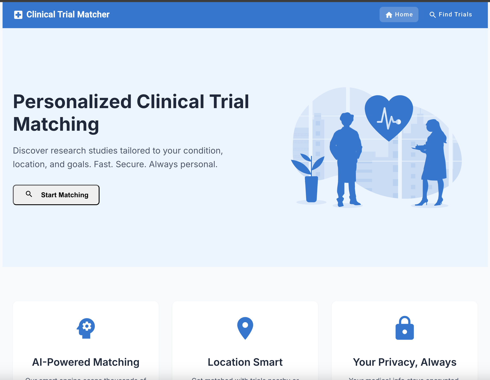
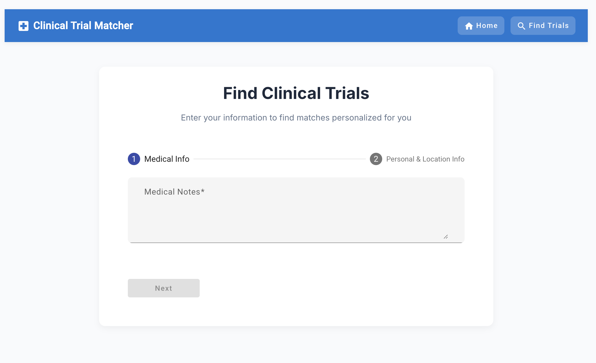
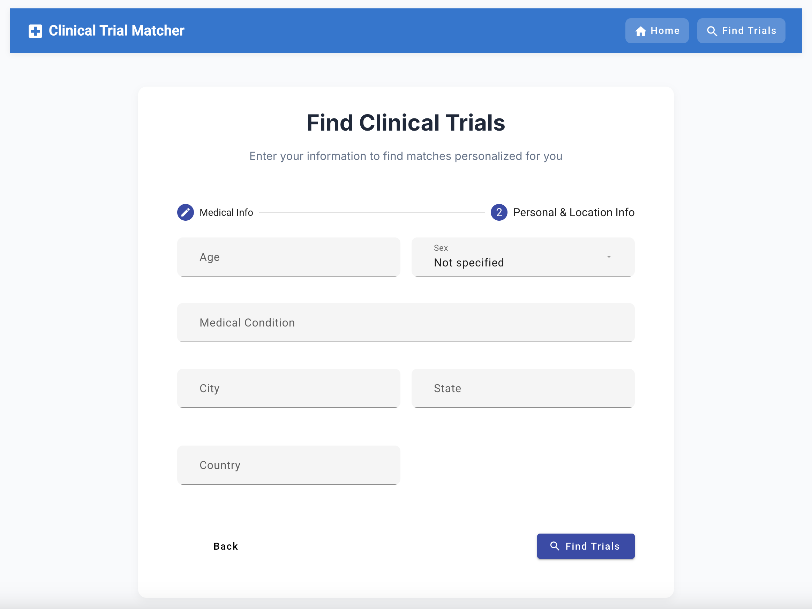
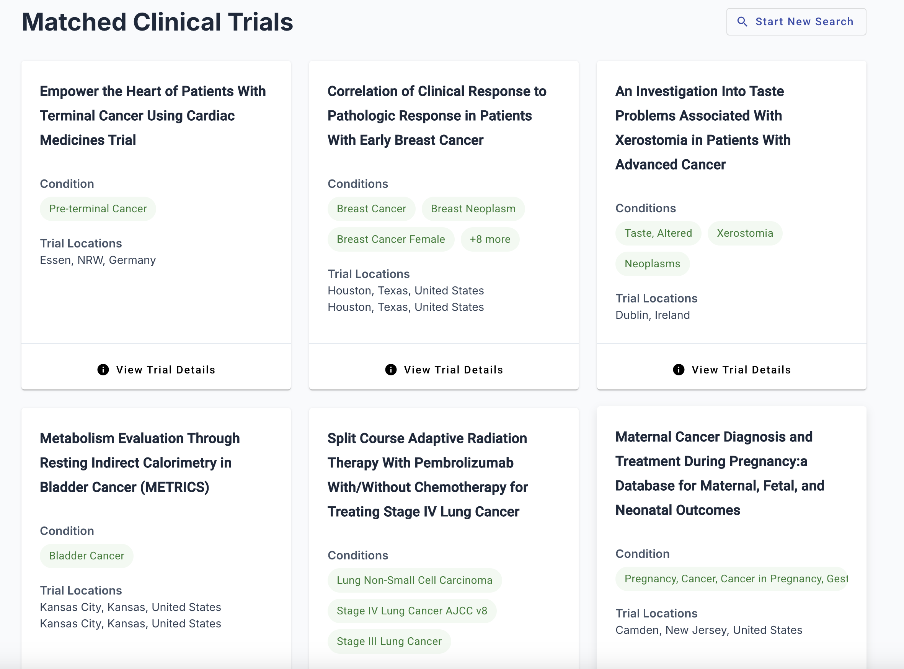
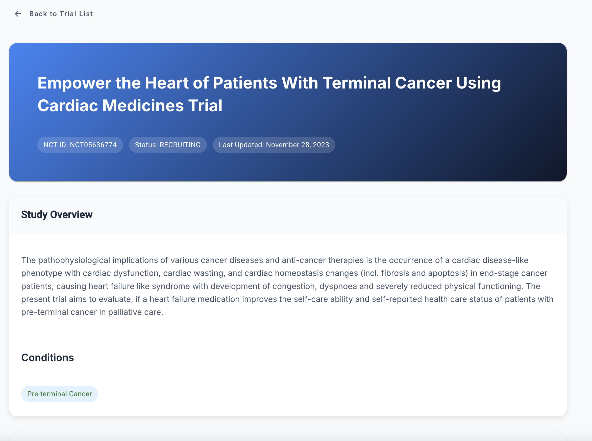

# Clinical Trial Matcher

An AI-powered application that matches patients with relevant clinical trials using semantic similarity and natural language processing.

## Demo

<div>
    <a href="https://www.loom.com/share/66f19779c19f44e3b9a13dd8cc660671" target="_blank">
      <p>Clinical Trial Matcher - 12 April 2025 - Watch Video</p>
    </a>
    <a href="https://www.loom.com/share/66f19779c19f44e3b9a13dd8cc660671" target="_blank">
      
    </a>
  </div>

## Features

- 🤖 AI-powered matching using OpenAI embeddings
- 🔍 Search through 1,000 actively recruiting clinical trials
- 📍 Location-based filtering
- 📱 Responsive design for desktop and mobile
- ⚡ Real-time matching results

## Screenshots

### Homepage


_Landing page with introduction to the application_

### Patient Form



_Form for entering patient medical information_

### Trial Results


_List of matched clinical trials with relevance scores_

### Trial Details


_Detailed view of a specific clinical trial_

## Quick Start

### Prerequisites

- Docker Desktop
- OpenAI API key

### Installation

1. Clone the repository:

```bash
git clone https://github.com/kaleabtesfaye01/clinical-trial-matcher.git
cd clinical-trial-matcher
```

2. Create a `.env` file in the root directory with the following content:

```properties
OPENAI_API_KEY=your_api_key_here
DB_USER=your_db_user
DB_PASSWORD=your_db_password
DB_NAME=your_db_name
```

3. Start the application:

```bash
docker compose up --build
```

4. Access the application:

- Frontend: http://localhost:80
- API: http://localhost:5230

## Technology Stack

- **Frontend**: Angular 19 with Material UI
- **Backend**: ASP.NET Core 9 Web API
- **Database**: PostgreSQL with pgvector extension
- **AI/ML**: OpenAI API for text embeddings
- **Containerization**: Docker

## Demo Limitations

This demo version includes:

- A subset of 1,000 actively recruiting trials from ClinicalTrials.gov
- Basic matching functionality using semantic similarity
- Sample patient profiles for testing

## Development

To run the application in development mode:

1. Start the database only:

```bash
docker compose up db
```

2. Run the backend (in a new terminal):

```bash
cd server
dotnet run
```

3. Run the frontend (in a new terminal):

```bash
cd client
npm install
npm start
```

## Contributing

1. Fork the repository
2. Create your feature branch (`git checkout -b feature/amazing-feature`)
3. Commit your changes (`git commit -m 'Add some amazing feature'`)
4. Push to the branch (`git push origin feature/amazing-feature`)
5. Open a Pull Request

## Acknowledgments

- ClinicalTrials.gov for trial data
- OpenAI for embedding API
- Angular team for the framework
